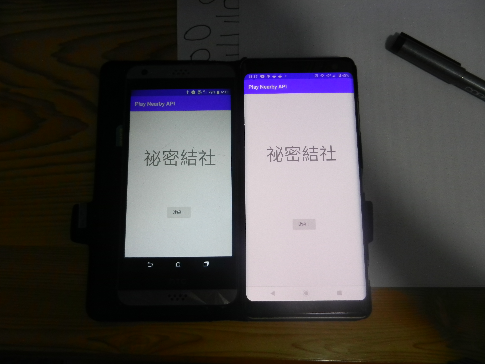

* App 名稱:　匿名聊天
* App 簡介: 我們希望做出有別於line、telegram等等實名聊天，且需要網路才能使用的app，此app利用android的nearby api來實作以藍芽、wifi等功能，來找尋手機附近的其他app使用者，進行一對一的匿名聊天；除此之外，本app因使用藍芽傳輸，故在沒有網路下亦可傳送訊息至其他使用者，達到更多層面的應用。
* App 畫面簡介:

* App 技術說明: Neaby API 提供了兩個主要的 API 介面，這個 Project 所使用的是不需要網路的 [Nearby Message API](https://developers.google.com/nearby/messages/overview)
* reference:
1. [Nearby API](https://developers.google.com/nearby)
2.
3. 
